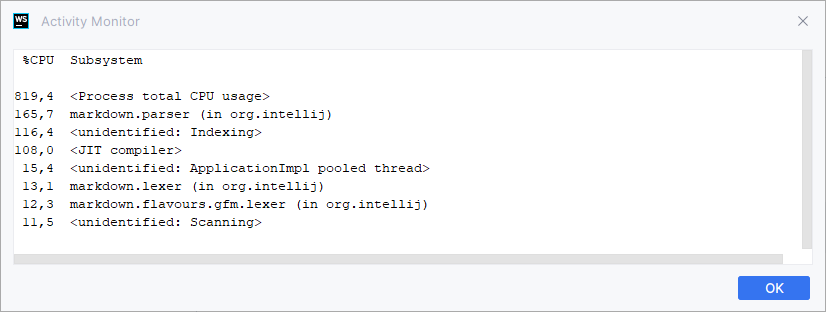

#webstorm #idea-ide 

# WebStorm тормозит 

Что делать, если WebStorm тормозит? — Чекать Activity Monitor 

Так я выяснил, что когда я редактирую svelte-файл, ide почему-то вызывает markdown-parser, а вместе с этим жестко тормозит — отключение markdown-плагина помогло

