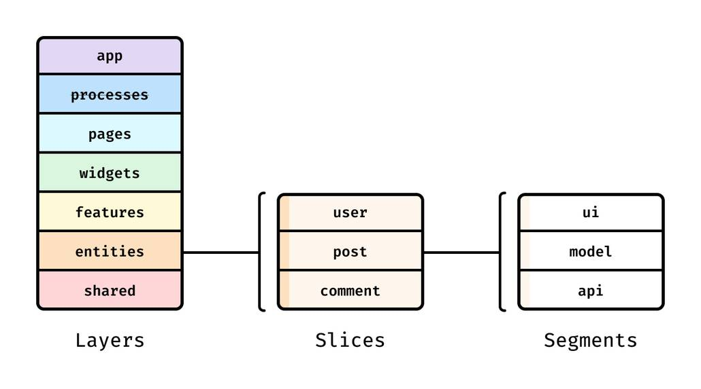
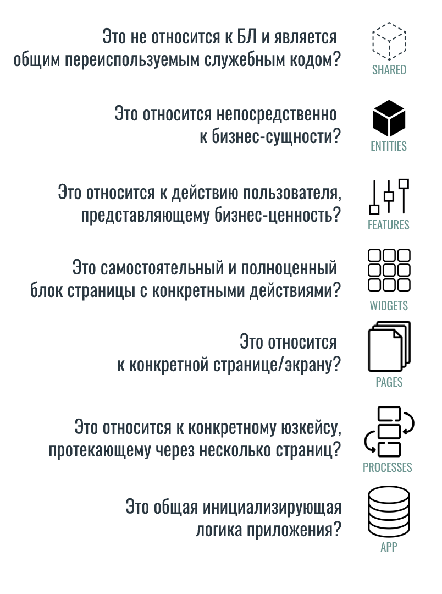
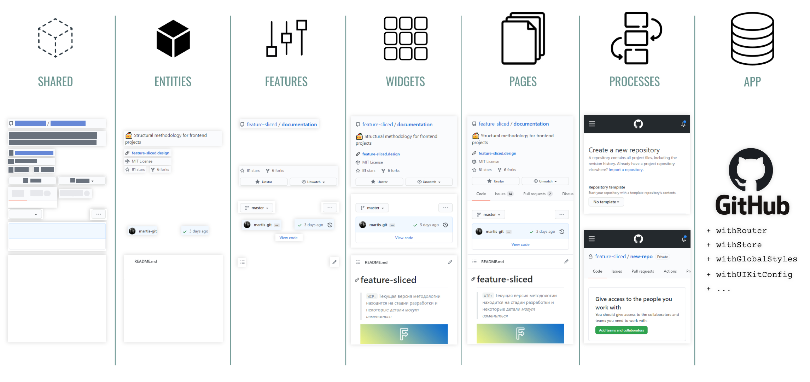

#fsd #architecture #frontend 

# FSD

- FSD = Feature Sliced Design = https://feature-sliced.design/ru/
	- https://feature-sliced.design/ru/docs/get-started/overview
	- https://feature-sliced.design/ru/docs/get-started/tutorial
	- https://feature-sliced.design/ru/docs/guides
	- [ ] https://feature-sliced.design/ru/docs/reference
- FSD = Frontend Architecture = Atomic Design + DDD 

## Layers

1. `shared` — переиспользуемый код, не имеющий отношения к специфике приложения/бизнеса.(например, UIKit, libs, API)
	- >В большинстве случаев рекомендуется располагать `api` и `config` только в `shared`-слое
2. `entities` (сущности) — бизнес-сущности.(например, User, Product, Order)
3. `features` (фичи) — взаимодействия с пользователем, действия, которые несут бизнес-ценность для пользователя.(например, SendComment, AddToCart, UsersSearch)
4. `widgets` (виджеты) — композиционный слой для соединения сущностей и фич в самостоятельные блоки(например, IssuesList, UserProfile).
5. `pages` (страницы) — композиционный слой для сборки полноценных страниц из сущностей, фич и виджетов.
6. `processes` (процессы, устаревший слой) — сложные сценарии, покрывающие несколько страниц.(например, авторизация)
7. `app` — настройки, стили и провайдеры для всего приложения.

### Пример

Рассмотрим приложение социальной сети.

- `app/` содержит настройку роутера, глобальные хранилища и стили.
- `pages/` содержит компоненты роутов на каждую страницу в приложении, преимущественно композирующие, по возможности, без собственной логики.

В рамках этого приложения рассмотрим карточку поста в ленте новостей.

- `widgets/` содержит "собранную" карточку поста, с содержимым и интерактивными кнопками, в которые вшиты запросы к бэкенду.
- `features/` содержит всю интерактивность карточки (например, кнопку лайка) и логику обработки этой интерактивности.
- `entities/` содержит скелет карточки со слотами под интерактивные элементы. Компонент, демонстрирующий автора поста, также находится в этой папке, но в другом слайсе.

## Slices

>Затем есть слайсы, разделяющие код по предметной области. Они группируют логически связанные модули, что облегчает навигацию по кодовой базе. Слайсы не могут использовать другие слайсы на том же слое, что обеспечивает высокий уровень связности (cohesion) при низком уровне зацепления (coupling).

## Segments

>В свою очередь, каждый слайс состоит из **сегментов**. Это маленькие модули, главная задача которых — разделить код внутри слайса по техническому назначению. Самые распространенные сегменты — `ui`, `model` (store, actions), `api` и `lib` (utils/hooks), но в вашем слайсе может не быть каких-то сегментов, могут быть другие, по вашему усмотрению.

- `ui`
- `model`
- `api`

## FAQ

### Формочки - это куда???

>Слайс на этом слое может содержать _интерактивные_ элементы пользовательского интерфейса, внутреннее состояние и запросы к API, которые позволяют выполнять действия, создающие ценность.

Исходя из этого, формы - это фича
Но но мб это сущность? 