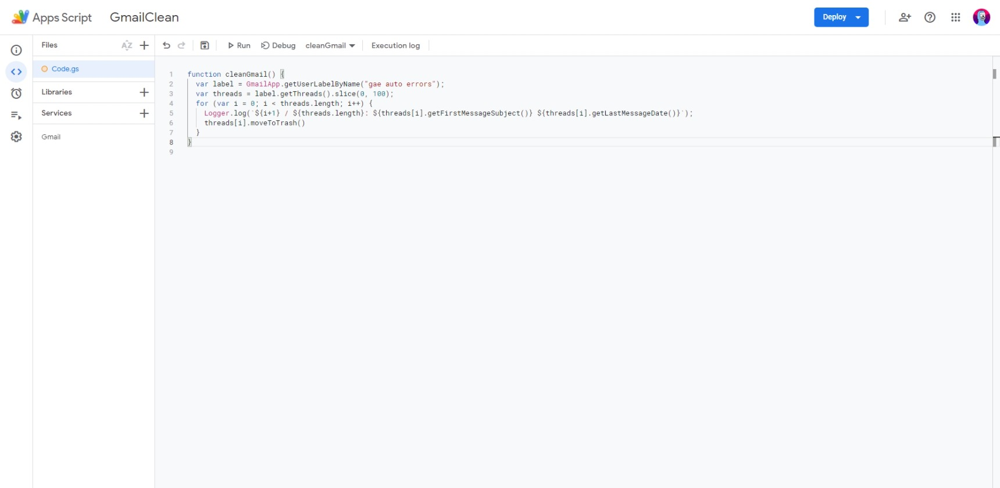
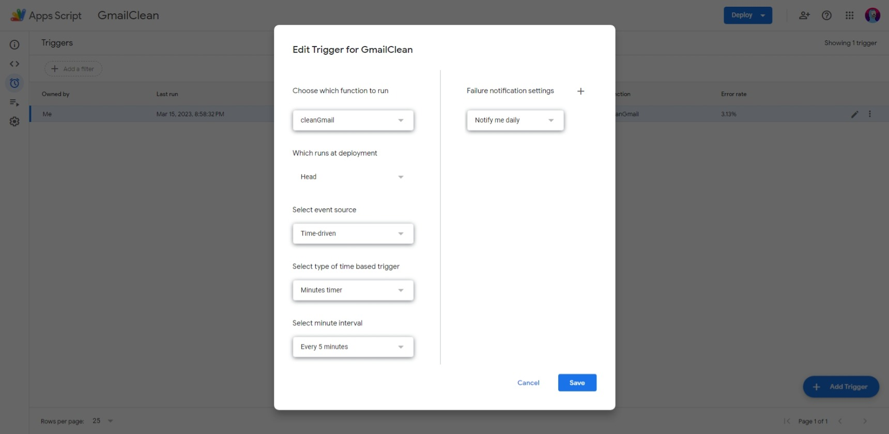

#apps-script #tools  

# Apps Script

[Apps Script](https://workspace.google.com/products/apps-script/) - JavaScript с подключенными Google-апишками

Хорош для скриптиков, которые юзают гугл-сервисы:

- Чтение и редактирование Google Sheets
- [Перемешивание YouTube плейлистов](https://github.com/potykion/yt-shuffle)
- [Чистка Gmail](Чистка%20GMail.md)

Что еще есть:

- [IDEшка](https://script.google.com/home)
- Триггеры - возможность запускать скрипты автоматически по событию, напр. временному - раз в час

