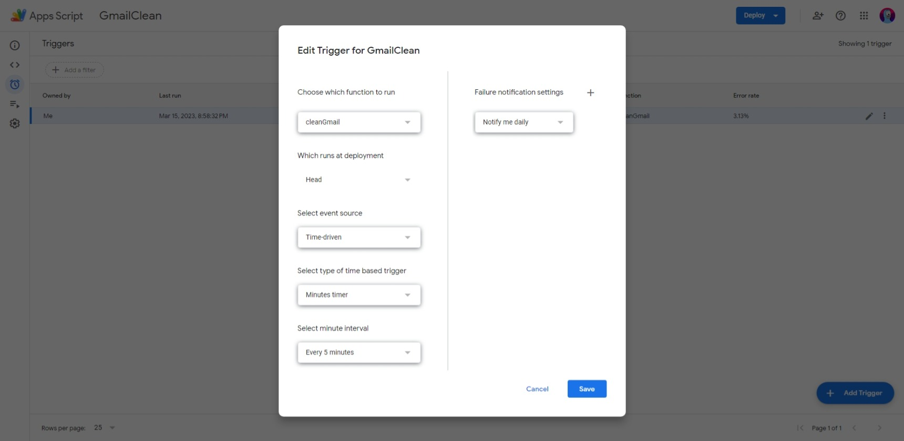

#apps-script

# Как автоматически почистить GMail почту?

**Юзать [Apps Script](Apps%20Script.md)!** 

1. Пишем скрипт:

    ```javascript
    function cleanGmail() {
      GmailApp.getUserLabelByName("label").getThreads().slice(0, 100).forEach(t => t.moveToTrash());
    }
    ```

2. Запускаем **для авторизации** и дебага

3. **Делаем триггер** - раз в 5 минут будем удалять по 100 тредов (цепочек сообщений с одной темой):
   
    

**Все!**

## Скрипт с выводом состояния

Чисто для дебага

```js
function cleanGmail() {
  var label = GmailApp.getUserLabelByName("СЮДА НАЗВАНИЕ ЛЕЙБЛА");
  var threads = label.getThreads().slice(0, 100);
  for (var i = 0; i < threads.length; i++) {
    Logger.log(`${i+1} / ${threads.length}: ${threads[i].getFirstMessageSubject()} ${threads[i].getLastMessageDate()}`);
    threads[i].moveToTrash()
  }
}
```