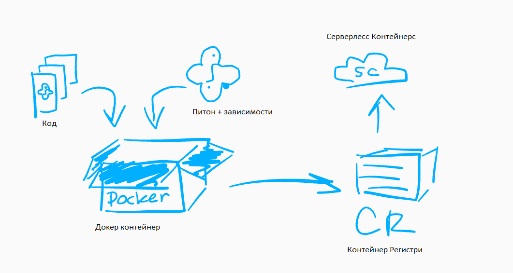

---
tags:
  - ops
---

# Yandex Cloud

## Serverless Containers

### Что это?

- [Serverless Containers](https://cloud.yandex.ru/services/serverless-containers) (sc) - сервис, позволяющий запускать
  Docker-контейнеры, не парясь об инфраструктуре
- То есть получаем простейший воркфлоу:
    - Создаем ServerlessContainers-контейнер/инстанц
    - Собираем Docker-образ - как обычно через `docker build`
    - Пушим его в Container-Registry - через `docker push`
    - Создаем новую версию / ревизию SC-контейнера



### Создание контейнера / инстанца

```shell
yc init
yc serverless container create --name {name}
# Выполняем, если хотим чтобы контейнер был публичным (доступным по http без необходимости авторизовываться)
yc serverless container allow-unauthenticated-invoke {name}
```

### [Новая версия / ревизия](https://cloud.yandex.ru/docs/cli/cli-ref/managed-services/serverless/container/revision/deploy)

```shell
yc serverless container revision deploy
# Айди ServerlessContainers-контейнера - получили выше  
--container-id {id} 
# cr_id - айди Container Registry (CR)
# image_name - название Docker-Image из CR
--image cr.yandex/{cr_id}/{image_name} 
# Айди сервисного аккаунта - получили выше
--service-account-id {service_acc_id}
# Сколько времени может выполняться конейнер
--execution-timeout 20s
# Сколько памяти может сожрать контейнер во время выполнения 
--memory 256MB
# Сколько контейнеров должно быть запущено всегда
# Если не указывать этот параметр, то будет cold-start - контейнер будет запускаться с некотой задержкой
--min-instances 1
# Переменные среды, которые будут выставляться при docker run (через запятую)
--environment DATABASE_URL=$DATABASE_URL,SENDGRID_API_KEY=$SENDGRID_API_KEY
```

### Важности

- Важно запускать свою Docker-приложуньку на порту из переменной среды `PORT`

### Ошибочки

- `http://127.0.0.1/endpoint EOF` - контейнер работает, нормально задеплоен, но во время его выполнения произошла ошибка
- Надо смотреть логи, чтобы понять в чем дело
- Например, запустили django через gunicorn и получили `worker terminated with signal 9` - значит мало памяти 


## Cloud Functions

- Cloud Functions (cf) - аналог aws-lambda - позволяет запускать код без всяких докеров/серверов - просто пишешь код, заливаешь его и можно запускать готовый ендпоинт и там само все масштабируется - т.е. еще проще sc

> [!danger] CF и concurency
> Запуск нескольких js-`Promise`-ов ведет к жесточайшему замедлению функции - так что лучше делать `await` последовательно, а не через `Promise.all`


